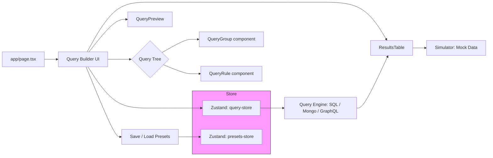

# QueryCraft — Visual Query Builder

QueryCraft is an interactive visual query builder demo built on Next.js, TypeScript and TailwindCSS. It demonstrates a recursive query tree UI, drag-and-drop reordering, JSON import/export (presets), a small query-generation engine (SQL, MongoDB, GraphQL), and a simulator for previewing results.

## Architecture Overview

- Framework: Next.js (App router) + React 19 + TypeScript
- Styling: TailwindCSS + CSS variables
- State: Zustand store (normalized recursive tree) for the query model and presets store
- Interactions: @dnd-kit for drag-and-drop with `DragOverlay` and `useSortable`
- Query engine: Generator functions produce SQL, MongoDB (filter objects), and GraphQL query strings from the query tree
- Simulator: in-memory mock dataset engine for quick feedback and results preview



## Recursive Rendering Strategy

- The UI renders the query model as a recursive tree of `QueryGroup` and `QueryRule` nodes.
- Each `QueryGroup` maps to a container component that renders its children by mapping over `group.children` and recursively rendering `QueryGroup` for nested groups and `QueryRule` for leaf rules.
- Keys: nodes use stable string `id` values (generated by `generateId`) to keep React reconciliation stable during reorders and edits.
- Overlays: when dragging, a `DragOverlay` is rendered at the top-level so the dragged element appears above the layout and follows the pointer; the original tree shows animated placeholders.

## State Management Decisions

- Central store: Zustand holds the canonical query tree (`rootGroup`), `schemaId`, validation state, selection, and undo/redo snapshots.
- Normalized vs recursive: We opted for a recursive tree structure (each group contains children), because the UI needs to render the tree recursively and operations like "insert into group" are naturally expressed this way.
  - The store provides helper functions for tree operations: `findNode`, `updateNodeInTree`, `removeNodeFromTree`, `moveNodeInTree`, `addChildToGroup`, and import/export sanitizers.
- Snapshots: simple snapshot stack is used for undo/redo (push shallow clones after significant mutations).
- Presets: a separate `presets-store` manages saved query presets (persisted to localStorage) to keep concerns isolated.

## Query Engine Design

- Purpose: convert the internal query tree into human-readable or executable query forms: SQL WHERE clauses, MongoDB filter objects, and GraphQL `filter` argument strings.
- Strategy:
  - Traverse the tree and collect clauses for rules; groups produce parenthesized sub-clauses joined by logical operators (`AND` / `OR`).
  - For SQL: produce parameterized-like strings (not yet bound parameters) and basic escaping for strings.
  - For Mongo: build nested filter objects (e.g., `{ $and: [...], field: { $in: [...] } }`).
  - For GraphQL: render a JSON-like filter string compatible with simple GraphQL server conventions used in examples.
- Trade-offs: the generator is intentionally lightweight and does not aim to handle every SQL dialect or production-level escaping — it's sufficient for demos and simulation.

## Performance Techniques

- Memoization: components that render lists or heavy subtrees use `React.memo` / `useMemo` so unchanged subtrees avoid re-rendering.
- Stable keys: every query node uses a stable `id` so list reconciliation and animated reorders remain smooth.
- Component isolation: `QueryRule` and `QueryGroup` are small focused components; inline controls are memoized where appropriate.
- Event decoupling: heavy operations (e.g., running the simulator) are triggered by explicit user actions (Run Query) or debounced keyboard shortcuts to avoid excessive recalculation.
- Drag performance: `@dnd-kit` uses hardware-accelerated transforms for overlays and animated transitions; `DragOverlay` rendering is cheap and avoids repainting the entire tree during drag.

## Trade-offs & Design Decisions

- Recursive tree vs normalized map:
  - Recursive tree is simpler for rendering and for expressing nested order semantics; it requires careful tree-walking helpers for mutation.
  - A normalized map (ids pointing to parent/children arrays) can make some operations O(1) but complicates rendering logic and reassembly.
- Query generator complexity:
  - We prioritized readability and clarity over complete SQL dialect coverage. This keeps the engine easy to extend during the exercise.
- Validation timing:
  - Validation is run on-demand (Run Query) to avoid noisy validation on every keystroke — improves UX for large trees.

## Files / Components of Interest

- `src/components/query-builder/QueryBuilder.tsx` — top-level builder that wires DnD context and renders the root group.
- `src/components/query-builder/QueryGroup.tsx` — recursive group renderer and droppable container.
- `src/components/query-builder/QueryRule.tsx` — rule row with field/operator/value controls and drag handle.
- `src/store/query-store.ts` — central Zustand store for the query tree and helper mutation methods.
- `src/store/presets-store.ts` — manages load/save/delete of presets (localStorage backed).
- `src/lib/query-engine.ts` — SQL / Mongo / GraphQL generators.
- `src/lib/simulator.ts` — in-memory simulator to preview results against mock datasets.

## Setup & Development

Prerequisites: Node 18+, pnpm (recommended) or npm/yarn.

Install dependencies and run dev server:

```bash
cd frontend
pnpm install
pnpm dev
```

Open http://localhost:3000 in your browser.

Build for production:

```bash
pnpm build
pnpm start
```

## Testing

- The project includes UI components suitable for manual testing. Use the `Run Query` button or `Ctrl+Enter` shortcut to execute the simulation and confirm results.
- Drag-and-drop: try reordering rules and groups using the vertical grip handle; confirm that cyclic moves are blocked.

## Deployment

- This is a standard Next.js app and can be deployed to Vercel, Netlify, or any Node.js host.
- Vercel recommended steps:

```bash
# from repo root
cd frontend
pnpm build
# push to a branch and connect repository in Vercel dashboard
```

## Contributing / Extending

- Add new operators or field types in `src/lib/types.ts` and extend `src/components/query-builder` controls and `src/lib/query-engine.ts` to support codegen for the new operators.
- To improve SQL generation for production safety, add parameter binding and use a real SQL builder library.

## License

This repository is provided for demonstration and learning purposes.
